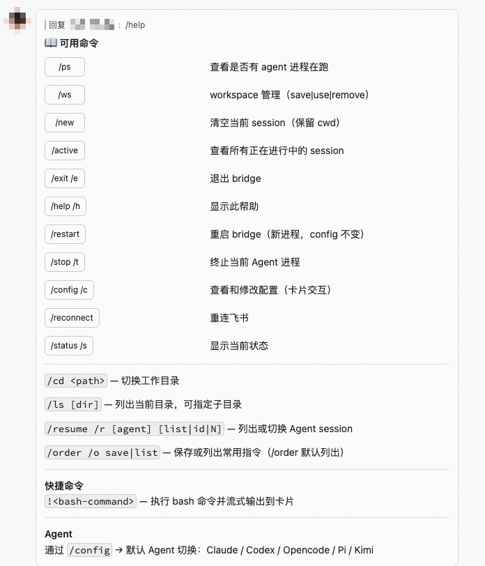

# lark-remote

[English](README.en.md) | 简体中文

[](LICENSE)
[](https://www.npmjs.com/package/lark-remote)
[](https://github.com/bungabungawoda/lark-remote/actions/workflows/ci.yml)

飞书私聊 ↔ 本地 Coding Agent 桥接。在飞书里和 Claude Code（或 Codex / opencode / pi / Kimi）对话，agent 在你指定的本地目录里读写文件、跑命令，执行过程以 CardKit 2.0 卡片**单卡实时流式**呈现。

单用户、p2p 私聊场景设计，不修改 agent 的 system prompt。



> **第一次接触本项目？先看 [docs/zh/getting-started.md](docs/zh/getting-started.md)。**

## ⚠️ 安全警告（必读）

本工具会把飞书消息直接转为本地 agent 执行，agent 默认以**完全权限**运行（Claude `bypassPermissions`、Codex `approval_policy=never` + full access），等价于把一台机器的 shell 交给聊天对端。请务必：

- **仅限你自己的私聊（p2p）使用**。不要把机器人拉进任何群聊，不要让任何其他人能与它对话。
- 在飞书开放平台把应用可见范围限制到**只有你自己**。
- 运行本工具的机器上不要存放与损失承受力不符的数据；建议在独立用户/机器/容器里运行。
- `appSecret` 等凭据只在本地 `config.yaml`，**不要提交到任何仓库**。

## 前置条件

- 操作系统：macOS / Linux。**暂不支持 Windows**（依赖 Unix 信号、bash、文件锁等 POSIX 行为）
- Node.js 20+（开发时用 [Bun](https://bun.sh/)）
- 飞书自建应用（二选一）：扫码创建（首次启动终端弹二维码，飞书 App 扫码即自动创建并写入凭据）；或手动在开放平台建应用——开启机器人能力，订阅 `im.message.receive_v1` 和 `card.action.trigger`，订阅方式选「长连接」（WebSocket，无需公网地址），权限至少 `im:message`。
- Claude Code CLI：本地安装并在终端完成一次登录（`claude` → 浏览器 OAuth）。使用其他 agent（codex / opencode / pi / kimi）同理，先装好对应 CLI。

## 安装

方式一：npm / npx（无需 clone）：

```bash
npx lark-remote          # 直接运行
# 或全局安装
npm install -g lark-remote
lark-remote
```

方式二：从源码安装：

```bash
git clone https://github.com/bungabungawoda/lark-remote.git
cd lark-remote
bun install
bun run build
bun install -g "$(pwd)"  # 全局安装为 lark-remote 命令（相对路径 `.` 会触发 bun unsafe name bug，须绝对路径）
```

## 配置

首次启动若检测不到飞书凭据：交互式终端会进入扫码创建向导（终端打印二维码，飞书 App 扫码即创建应用并写入凭据，随后继续启动）；非交互环境则在 `~/.lark-remote/config.yaml` 生成模板并退出，填写凭据后重启。完整字段见 [`docs/zh/usage.md`](docs/zh/usage.md)，关键项：

```yaml
feishu:
  appId: cli_xxx
  appSecret: xxx

# 默认 agent：claude | codex | opencode | pi | kimi，默认 claude
defaultAgent: claude

claude:
  model: claude-opus-4-8
  effort: medium            # low | medium | high | xhigh | max
  # permissionMode 硬编码为 bypassPermissions（runner 内部）
  stopGraceMs: 5000

output:
  showThinking: true
  showToolUse: true
  showToolResult: true

logging:
  level: info               # debug | info | warn | error

idle:
  watchdogMinutes: 15       # 0 关闭空闲看门狗
```

配置目录可用 `--config-dir <path>` 覆盖；Claude settings 路径可用 `--settings <path>` 或 `CLAUDE_SETTINGS_PATH` 环境变量覆盖。

## 运行

```bash
lark-remote                                     # 全局安装 / npx 后直接用
bun run dev                                     # 开发（bun 直跑 TS）
bun run build && node dist/index.js             # 编译后运行

# CLI 参数
lark-remote --config-dir ~/.lark-remote-test    # 自定义配置目录（同机多实例）
lark-remote --settings ~/.claude/settings.json  # 指定 Claude 配置文件
```

bridge 启动后不在终端输出，运行日志写入 `~/.lark-remote/logs/YYYY-MM-DD/lark-remote-<pid>.log`（按日期轮转，每天一个子目录）。同一 `configDir` 只允许一个 `lark-remote` 实例，重复启动会直接报错并提示已有 pid。连接飞书成功后会向最近私聊用户发送启动通知，包含启动时间和进程号。

每次 agent 运行会创建一张 CardKit 2.0 卡片，并在原地实时更新 thinking、正文和工具摘要。
卡片会读取 JSONL 的 `timestamp`，以本地时间 `YYYY-MM-DD HH:mm` 显示 thinking、正文、tool call/result 和会话历史事件。
结束时卡片明确显示完成、出错、中断或空闲超时；运行中的「⏹ 终止」按钮与 `/stop` 等价。
卡片采用有损滚动摘要，超长历史不会完整保留。
你的原消息上会收到表情回应：处理中先打 `Typing`，结束时按终态补打 `Done`（完成）/ `ERROR`（出错）/ `Alarm`（空闲超时）/ `SHHH`（你主动 `/stop`）；`!` bash 命令结束时固定打 `Done`。

## 命令

| 命令 | 别名 | 行为 |
|------|------|------|
| `/help` | `/h` | 命令列表 |
| `/cd <path>` | - | 切换 agent 工作目录（支持 `~`、绝对/相对路径，清空会话） |
| `/ls [dir]` | - | 弹出目录/文件卡片；点击目录切换，点击 30MB 内文件发送到飞书；条目 >30 时支持翻页 |
| `/ws save\|use\|remove` | - | 命名目录别名管理（`/ws` 默认列出） |
| `/resume [agent] [N\|id]` | `/r` | 列出/切换当前目录的 agent session（卡片） |
| `/active` | - | 列出所有正在进行中的 session |
| `/new` | - | 清空当前会话（保留工作目录） |
| `/status` | `/s` | 当前目录、session、模型、进程状态 |
| `/stop` | `/t` | 终止当前 agent 进程（SIGKILL） |
| `/ps` | - | 是否有进程在跑 |
| `/reconnect` | - | 重连飞书 |
| `/restart` | - | 原地自重启 bridge（新进程同 config 接管） |
| `/config get\|set` | `/c` | 查改运行时配置（agent-aware 卡片） |
| `/order save\|list` | `/o` | 保存或列出常用指令 |
| `!<cmd>` | - | 执行 bash 命令并流式输出到卡片（绕过串行队列） |
| `/exit` | `/e` | 退出 bridge |

直接发非 `/` 开头的消息即转发给当前默认 agent。

## 测试

```bash
bun run test          # vitest（单元/集成测试，全部离线可跑）
bun run typecheck     # tsc --noEmit
bun run lint          # eslint

# 真实飞书 API 集成测试（默认跳过，需要 ~/.lark-remote-test 下的有效凭据）
FEISHU_LIVE_TEST=1 bun run test tests/feishu-card-form-error.test.ts
FEISHU_LIVE_TEST=1 bun run test tests/feishu-reaction-emoji-live.test.ts
```

## 文档

完整文档目录 [`docs/`](docs/)：

- 入门指南：[`docs/zh/getting-started.md`](docs/zh/getting-started.md)
- 使用指南（安装、命令、工作流示例）：[`docs/zh/usage.md`](docs/zh/usage.md)
- 整体设计、JSONL 事件、已知坑点：[`docs/zh/architecture/design.md`](docs/zh/architecture/design.md)
- 单卡流式架构与飞书验收：[`docs/zh/architecture/streaming-card.md`](docs/zh/architecture/streaming-card.md)
- 新增 agent 接入模板：[`docs/zh/guides/add-new-agent.md`](docs/zh/guides/add-new-agent.md)
- Codex 配置卡片指南：[`docs/zh/guides/codex-config.md`](docs/zh/guides/codex-config.md)
- 飞书 CardKit 2.0 组件参考：[飞书开放平台官方文档](https://open.feishu.cn/document/feishu-cards/card-json-v2-components/component-json-v2-overview)
- AI 协作规则与红线：[`CLAUDE.md`](CLAUDE.md)

> 本包为纯 CLI 工具，不提供编程 API。

## License

[MIT](LICENSE) © bungabungawoda
